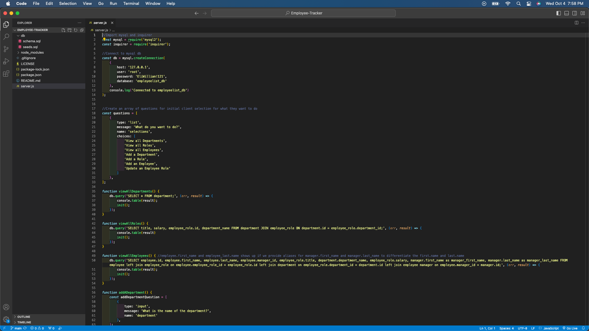
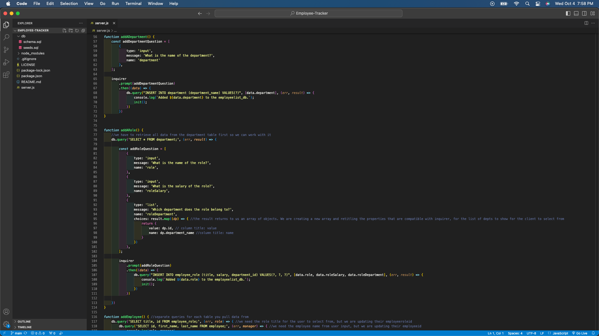
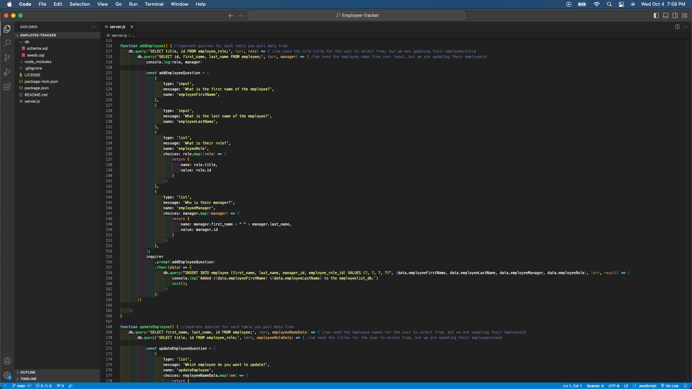
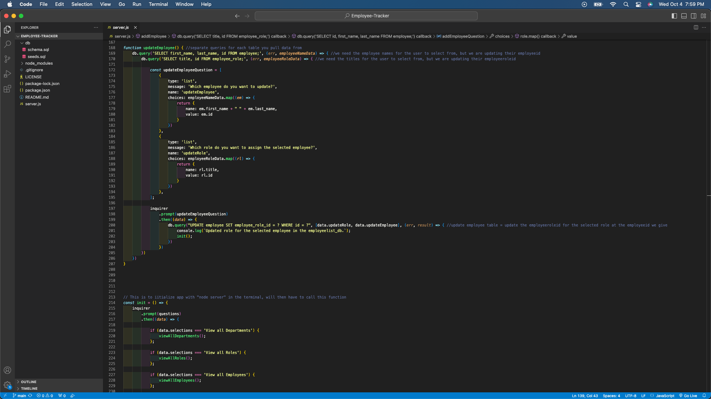
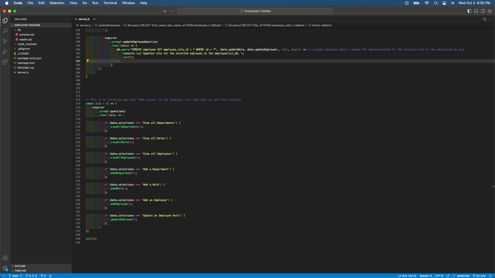
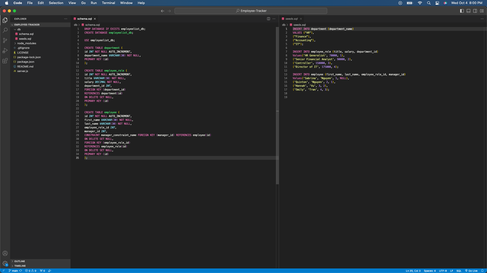

# Employee-Tracker

## Table of Contents
- [Description](#description)
- [Installation](#installation)
- [Usage](#usage)
- [License](#license)
- [Contribution](#contribution)
- [Tests](#tests)
- [Questions](#questions)

## Description
The purpose of creating an Employee-Tracker is to help non-developers easily manage information stored in a database.

View a video of the application here: https://drive.google.com/file/d/1SK38gS2ebzvg1MnR3nyyaJOEf6scIrhr/view?usp=sharing.

## Installation
VS Code for JavaScript. GibHub for version control.
Install inquirer in the VS Code command line: https://www.npmjs.com/package/inquirer/v/8.2.4. Install mysql2 in the VS Code command line to connect the MySQL database: https://www.npmjs.com/package/mysql2.

## Usage
Users can use this content management system (CMS) to manage their company's employee database.

View a screenshot of the imports, MySQL connection, initial questions array, and view functions in VS Code:

View a screenshot of the add department/add role functions in VS Code:

View a screenshot of the add employee function in VS Code:

View a screenshot of the update employee function in VS Code:

View a screenshot of the init function and call in VS Code:

View a screenshot of the MySQL files (schema and seeds) in VS Code:

## License
This project is under the MIT license.

## Contribution
The coding (imports, MySQL connection, MySQL queries, inquirer questions array, init function, creating tables and seeding the data) -all the additions- are credited to the curriculum taught by the instructor in the UCI coding boot camp. A tutor from the UCI coding boot camp also helped provide guidance on the MySQL queries. The assignment also gave instructions for setting up the database structures.
Information to structure the prompts can be found here: https://www.npmjs.com/package/inquirer/v/8.2.4.
To use JOIN for multiple tables, I referenced: https://learnsql.com/cookbook/how-to-join-on-multiple-columns/ and https://stackoverflow.com/questions/9810343/retrieving-data-from-three-tables-using-mysql. To self-reference in a MySQL table, I referenced: https://pencilprogrammer.com/self-referencing-foreign-key-in-mysql/ and https://stackoverflow.com/questions/2971593/self-referential-table-fields-in-mysql.

To complete the README with screenshots, the source for the code is: https://stackoverflow.com/questions/10189356/how-to-add-screenshot-to-readmes-in-github-repository.
To complete the README section, the source is: https://coding-boot-camp.github.io/full-stack/github/professional-readme-guide.
To complete the markdown for the README, the source is: https://www.markdownguide.org/basic-syntax/
https://gist.github.com/lukas-h/2a5d00690736b4c3a7ba
.

## Tests
To test the functionality of the Employee-Tracker, users can clone this repo, run npm install, and follow the video for steps on creating the schema from the MySQL shell (open the terminal and log into mysql, run ‘SOURCE schema.sql;’ in the command line, run ‘SOURCE seeds.sql;’ in the command line to seed the data), and starting the application’s server (run “node server” in the command line). Select any option from the list. To view any updates or changes made to the existing database, at the end, select “View all Employees”. View a video of the step-by-step here: https://drive.google.com/file/d/1SK38gS2ebzvg1MnR3nyyaJOEf6scIrhr/view?usp=sharing.

## Questions
The link to my Github Profile here: https://github.com/codeandlift706.
For any additional questions, please reach me at: channguyen715@gmail.com.
